# 📋 System Requirements Specification - Car Dealer Management System

## 📑 Содержание
1. [Введение](#intro)  
   1.1 [Назначение](#appointment)  
   1.2 [Бизнес-требования](#business_requirements)  
   1.3 [Аналоги](#analogues)  
2. [Требования пользователя](#user_requirements)  
   2.1 [Программные интерфейсы](#software_interfaces)  
   2.2 [Интерфейс пользователя](#user_interface)  
   2.3 [Характеристики пользователей](#user_specifications)  
   2.4 [Предположения и зависимости](#assumptions_and_dependencies)  
3. [Системные требования](#system_requirements)  
   3.1 [Функциональные требования](#functional_requirements)  
   3.2 [Нефункциональные требования](#non-functional_requirements)  
4. [Архитектура системы](#system_architecture)  
5. [Технологический стек](#tech_stack)  
6. [Безопасность и производительность](#security_performance)  
7. [Тестирование](#testing)  
8. [Развёртывание](#deployment)

---

## 1. 🧩 Введение

### 1.1 Назначение
Данный документ описывает функциональные и нефункциональные требования к веб-приложению **Car Dealer Management System**, предназначенному для управления автосалоном. Система предоставляет комплексное решение для управления автомобилями, дилерами, заказами и пользователями.

### 1.2 Бизнес-требования

#### 1.2.1 Исходные данные
Автосалоны нуждаются в эффективной системе управления:
- Учёт автомобилей и их характеристик
- Управление дилерами и их автомобилями
- Обработка заказов клиентов
- Управление пользователями и их предпочтениями
- Отслеживание избранных автомобилей

#### 1.2.2 Возможности проекта
Приложение позволяет:
- Автоматизировать процессы управления автосалоном
- Упростить учёт автомобилей и заказов
- Предоставлять аналитику по продажам и предпочтениям клиентов
- Улучшить взаимодействие с клиентами через систему избранного

#### 1.2.3 Доступный функционал
Система охватывает:
- CRUD-операции для автомобилей, дилеров, заказов и пользователей
- Систему избранных автомобилей
- Поиск и фильтрацию данных
- Аналитику по заказам и предпочтениям пользователей

### 1.3 Аналоги
- **DealerTrack** - комплексное решение для дилерских центров, но ориентировано на крупные предприятия
- **AutoSoft** - специализированное ПО для автосалонов, требует значительных инвестиций
- **VinSolutions** - CRM для автомобильных дилеров, но с ограниченными возможностями кастомизации

Данное приложение предлагает гибкое, современное решение с открытым исходным кодом и возможностью адаптации под конкретные нужды автосалона.

---

## 2. 👤 Требования пользователя

### 2.1 Программные интерфейсы
- REST API с поддержкой JSON
- Swagger UI для документации API
- Поддержка стандартных HTTP методов
- Валидация данных на стороне сервера

### 2.2 Интерфейс пользователя
Современный React-интерфейс с Material-UI, включающий:
- Адаптивный дизайн
- Интуитивно понятная навигация
- Таблицы с сортировкой и фильтрацией
- Диалоговые окна для форм
- Визуализация данных

### 2.3 Характеристики пользователей

#### 2.3.1 Аудитория приложения
- **Администраторы автосалонов** - управление автомобилями и дилерами
- **Менеджеры по продажам** - обработка заказов и работа с клиентами
- **Клиенты** - просмотр автомобилей и добавление в избранное

### 2.4 Предположения и зависимости
- Требуется Java 17+ для backend
- Node.js для frontend разработки
- PostgreSQL в качестве базы данных
- Поддержка современных браузеров

---

## 3. ⚙️ Системные требования

### 3.1 Функциональные требования

#### 3.1.1 Управление автомобилями
- ✅ Создание, редактирование, удаление автомобилей
- ✅ Валидация VIN (17 символов, уникальность)
- ✅ Управление характеристиками: марка, модель, год, цена, цвет, пробег
- ✅ Привязка к дилеру
- ✅ Отслеживание статуса (в заказе/доступен)

#### 3.1.2 Управление дилерами
- ✅ CRUD-операции для дилеров
- ✅ Уникальность названия, адреса и телефона
- ✅ Просмотр автомобилей дилера
- ✅ Поиск дилеров по бренду

#### 3.1.3 Управление заказами
- ✅ Создание и управление заказами
- ✅ Привязка автомобилей и пользователей
- ✅ Расчет общей стоимости заказа
- ✅ Отслеживание даты заказа

#### 3.1.4 Управление пользователями
- ✅ Регистрация и управление пользователями
- ✅ Система избранных автомобилей
- ✅ История заказов пользователя
- ✅ Валидация данных пользователя

#### 3.1.5 Система избранного
- ✅ Добавление/удаление автомобилей в избранное
- ✅ Отслеживание пользователей, добавивших автомобиль в избранное
- ✅ Валидация уникальности избранного

#### 3.1.6 Поиск и фильтрация
- ✅ Поиск по всем сущностям
- ✅ Фильтрация автомобилей по различным критериям
- ✅ Сортировка данных в таблицах
- ✅ Пагинация результатов

### 3.2 Нефункциональные требования

#### 3.2.1 Производительность
- Время отклика API < 200ms
- Поддержка 100+ одновременных пользователей
- Оптимизированные запросы к базе данных

#### 3.2.2 Надёжность
- Обработка ошибок и исключений
- Валидация входных данных
- Резервное копирование данных

#### 3.2.3 Безопасность
- Валидация всех входных данных
- Защита от SQL-инъекций
- Обработка конфликтующих операций
- Логирование операций

#### 3.2.4 Масштабируемость
- Микросервисная архитектура
- Поддержка Docker контейнеризации
- Возможность горизонтального масштабирования

---

## 4. 🏗️ Архитектура системы

## 4.1 Список автомобилей
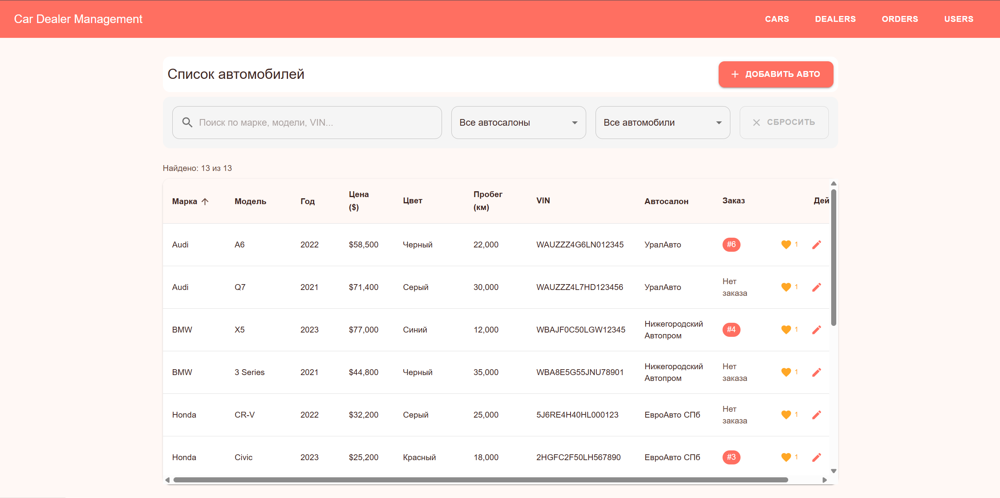

## 4.2 Список дилеров
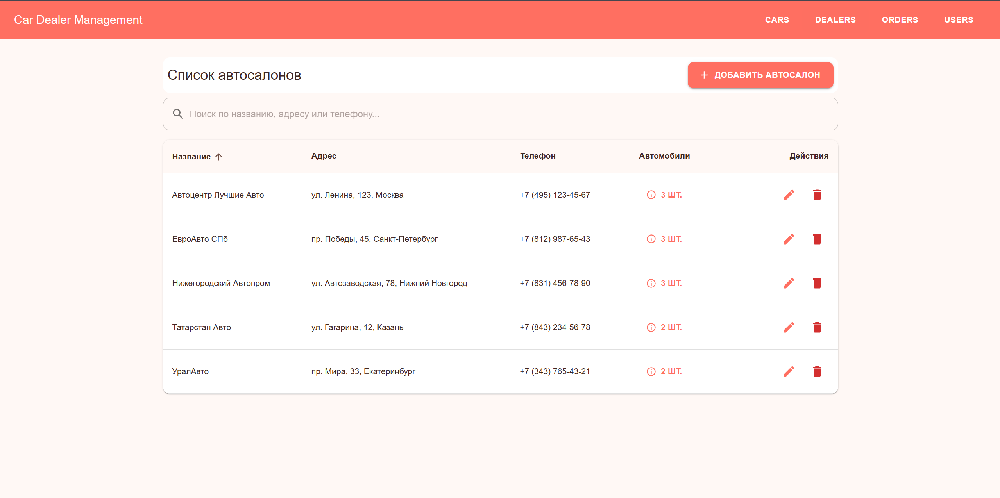

## 4.3 Список заказов
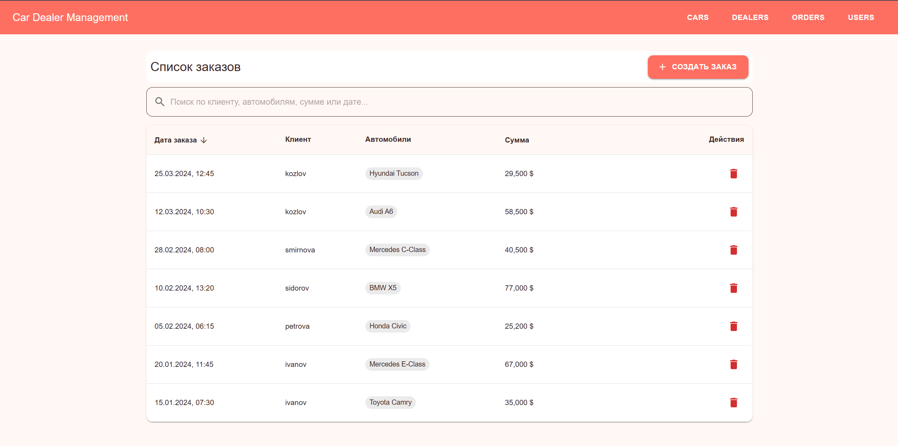

## 4.4 Список пользователей
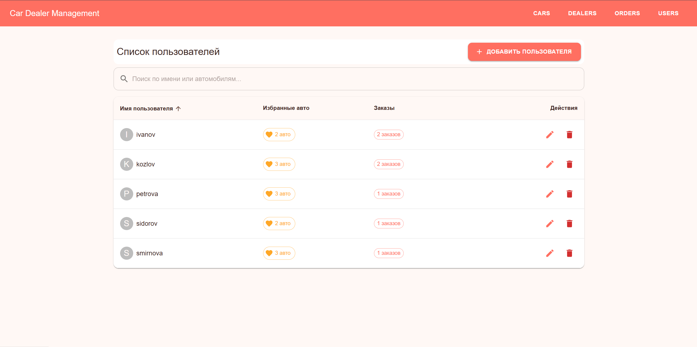

## 4.5 Пользователи которые добавили в избранное

## 4.6 Изменение автомобиля
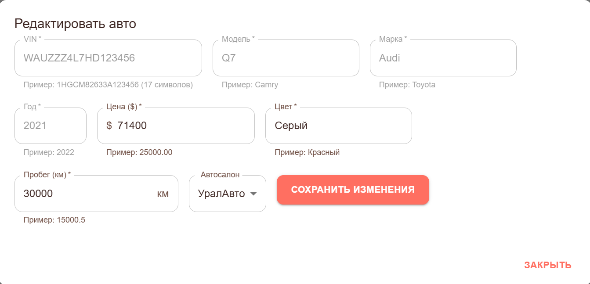

## 4.7 Изменение пользователя
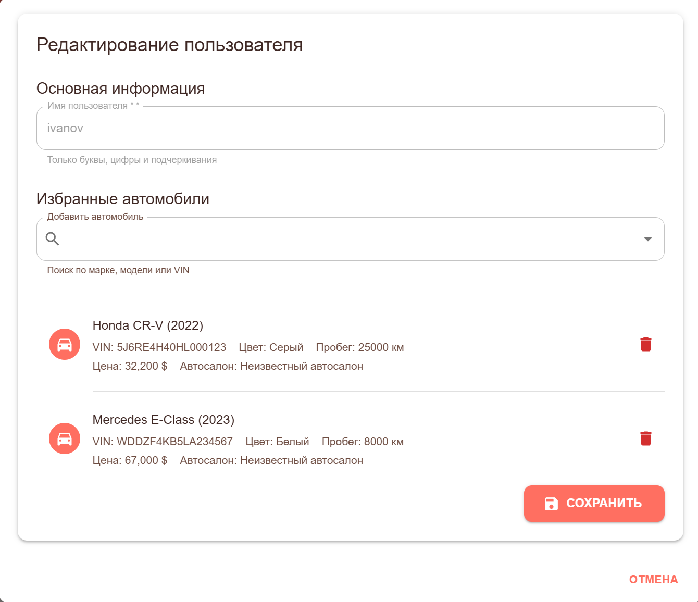

## 4.8 Изменение дилера
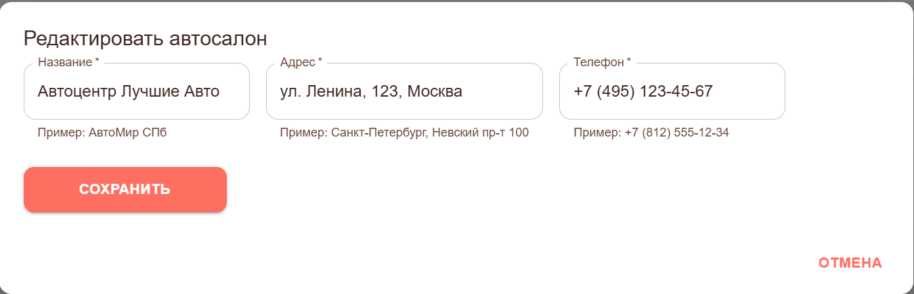

## 4.9 Добавление машины
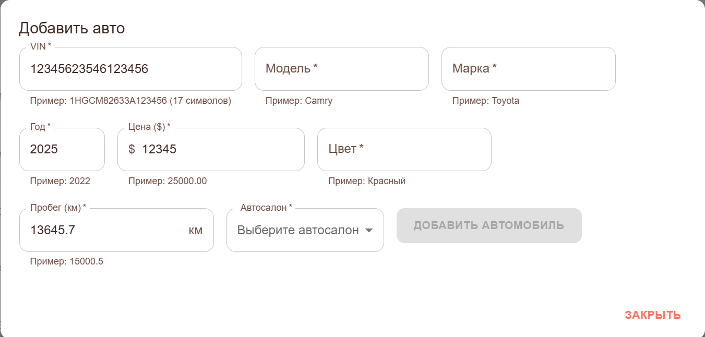

## 4.10 Добавление дилера
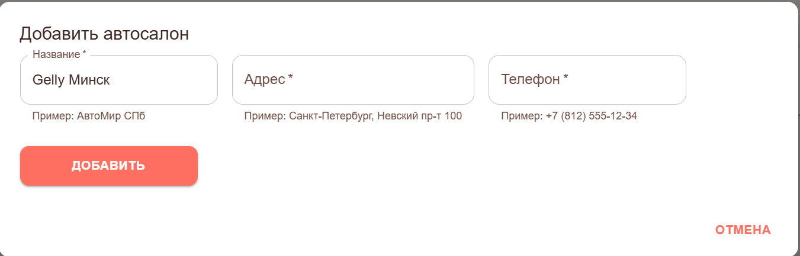

## 4.11 Добавление заказа
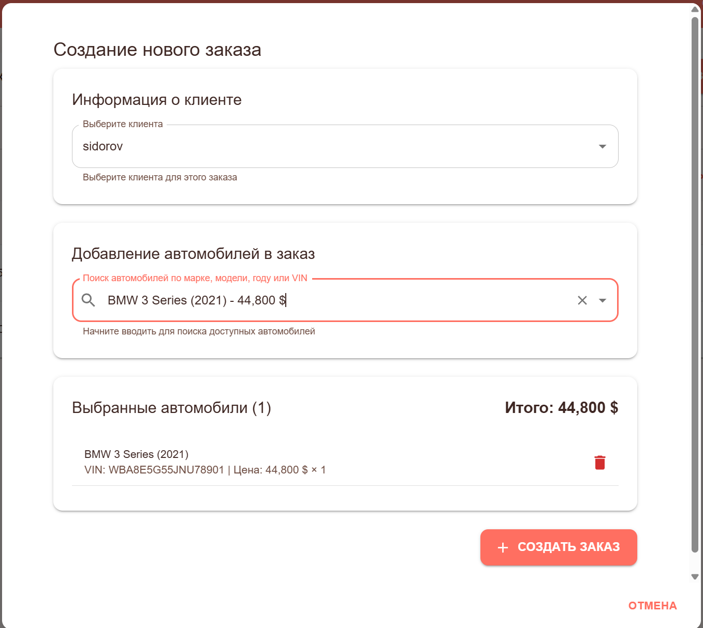

## 4.12 Добавление пользователя
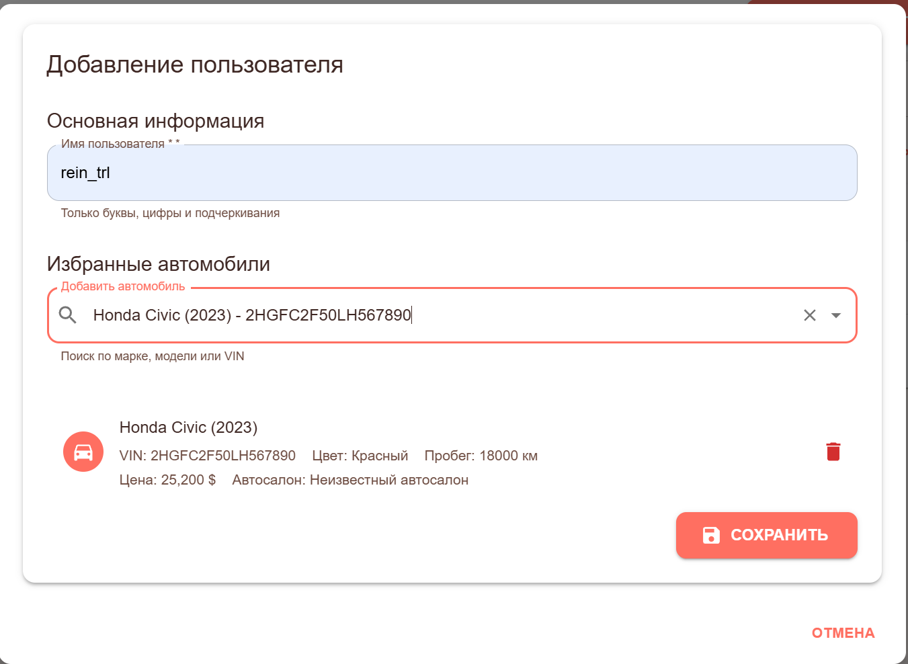

## 4.13 Добавление машины

## 4.14 Удаление машины
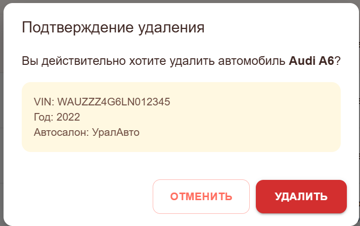

## 4.15 Удаление дилера
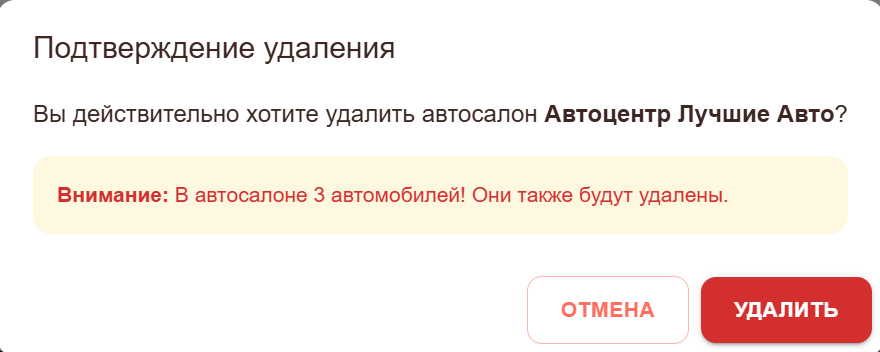

## 4.16 Удаление пользователя
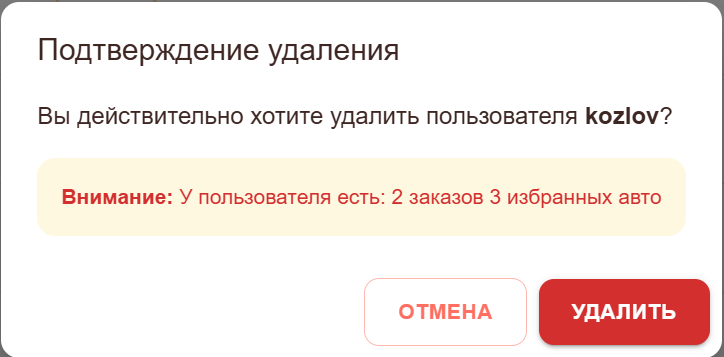

## 4.17 Удаление заказа
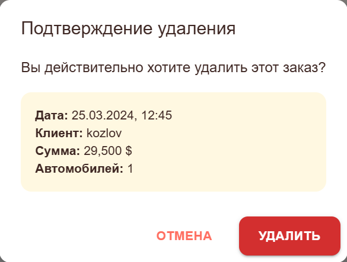

---

## 5. 🧰 Технологический стек

| Компонент         | Технология |
|------------------|------------|
| Backend           | Spring Boot 3.x, Java 17 |
| Frontend          | React 18, Material-UI |
| База данных       | PostgreSQL |
| ORM               | Hibernate, Spring Data JPA |
| API документация  | Swagger/OpenAPI 3 |
| Сборка            | Maven (backend), npm (frontend) |
| Контейнеризация   | Docker, Docker Compose |

---

## 6. 🔐 Безопасность и производительность

### 6.1 Безопасность
- Валидация всех входных данных на backend
- Защита от дублирования и конфликтующих операций
- Обработка исключений с информативными сообщениями
- Логирование операций для аудита

### 6.2 Производительность
- Оптимизированные SQL-запросы
- Пагинация данных
- Кэширование часто запрашиваемых данных
- Асинхронная обработка операций

---

## 7. 🧪 Тестирование

### 7.1 Юнит-тесты
- Тестирование сервисов и валидации
- Покрытие критической бизнес-логики

### 7.2 Интеграционные тесты
- Тестирование API endpoints
- Проверка взаимодействия между компонентами

### 7.3 Frontend тесты
- Тестирование React компонентов
- Проверка взаимодействия с API

---

## 8. 🚀 Развёртывание

### 8.1 Локальная разработка
- Запуск через Docker Compose
- Настройка профилей разработки

### 8.2 Продакшен развёртывание
- Docker контейнеризация
- Поддержка облачных платформ
- Настройка балансировщика нагрузки
- Мониторинг и логирование

### 8.3 Миграции базы данных
- Flyway для управления миграциями
- Автоматическое применение изменений

---

 

> 📌 **Примечание**: Система предоставляет полный цикл управления автосалоном с современным интерфейсом и надежным backend. Архитектура позволяет легко расширять функциональность по мере необходимости.
