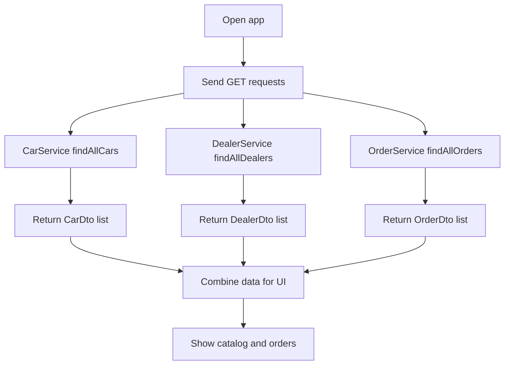
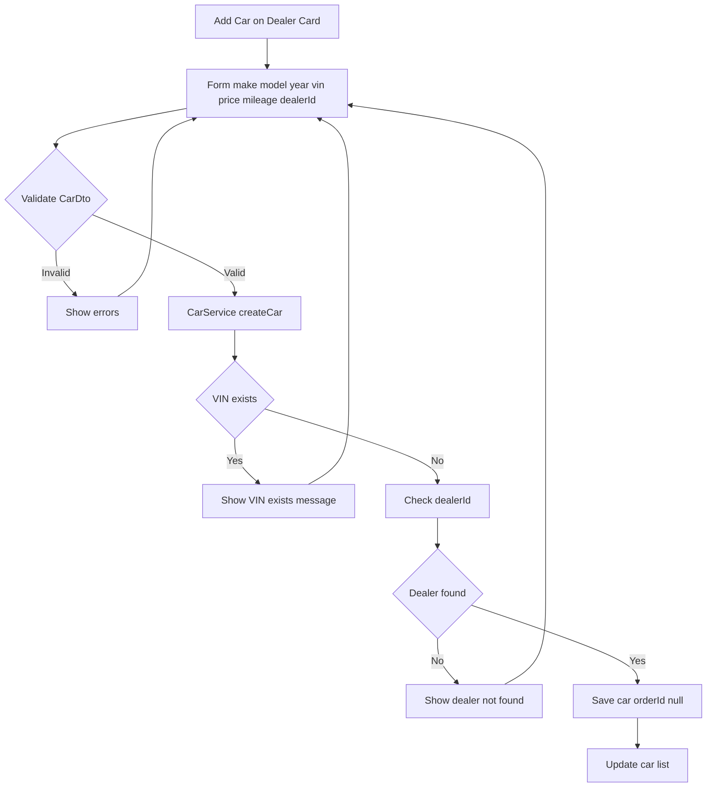
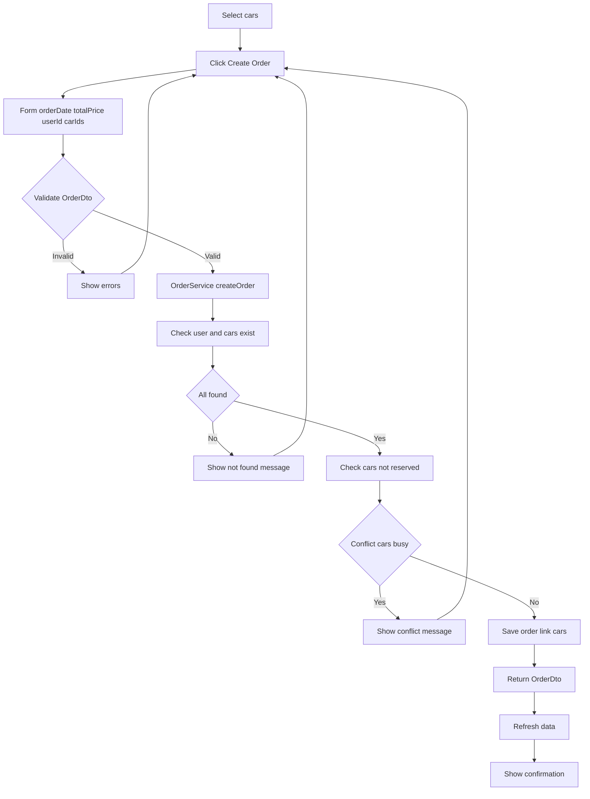

# 📊 Диаграммы активностей

### 1. Загрузка данных

```mermaid
flowchart TD
    A[Open app]
    A --> B[Send GET requests]
    B --> C1[CarService findAllCars]
    B --> C2[DealerService findAllDealers]
    B --> C3[OrderService findAllOrders]
    C1 --> D1[Return CarDto list]
    C2 --> D2[Return DealerDto list]
    C3 --> D3[Return OrderDto list]
    D1 --> E[Combine data for UI]
    D2 --> E
    D3 --> E
    E --> F[Show catalog and orders]
```

### 2. Добавление автомобиля

```mermaid
flowchart TD
    A[Add Car on Dealer Card]
    A --> B[Form make model year vin price mileage dealerId]
    B --> C{Validate CarDto}
    C -->|Invalid| D[Show errors]
    D --> B
    C -->|Valid| E[CarService createCar]
    E --> F{VIN exists}
    F -->|Yes| G[Show VIN exists message]
    G --> B
    F -->|No| H[Check dealerId]
    H --> I{Dealer found}
    I -->|No| J[Show dealer not found]
    J --> B
    I -->|Yes| K[Save car orderId null]
    K --> L[Update car list]
```

### 3. Оформление заказа

```mermaid
flowchart TD
    A[Select cars]
    A --> B[Click Create Order]
    B --> C[Form orderDate totalPrice userId carIds]
    C --> D{Validate OrderDto}
    D -->|Invalid| E[Show errors]
    E --> B
    D -->|Valid| F[OrderService createOrder]
    F --> G[Check user and cars exist]
    G --> H{All found}
    H -->|No| I[Show not found message]
    I --> B
    H -->|Yes| J[Check cars not reserved]
    J --> K{Conflict cars busy}
    K -->|Yes| L[Show conflict message]
    L --> B
    K -->|No| M[Save order link cars]
    M --> N[Return OrderDto]
    N --> O[Refresh data]
    O --> P[Show confirmation]
```
