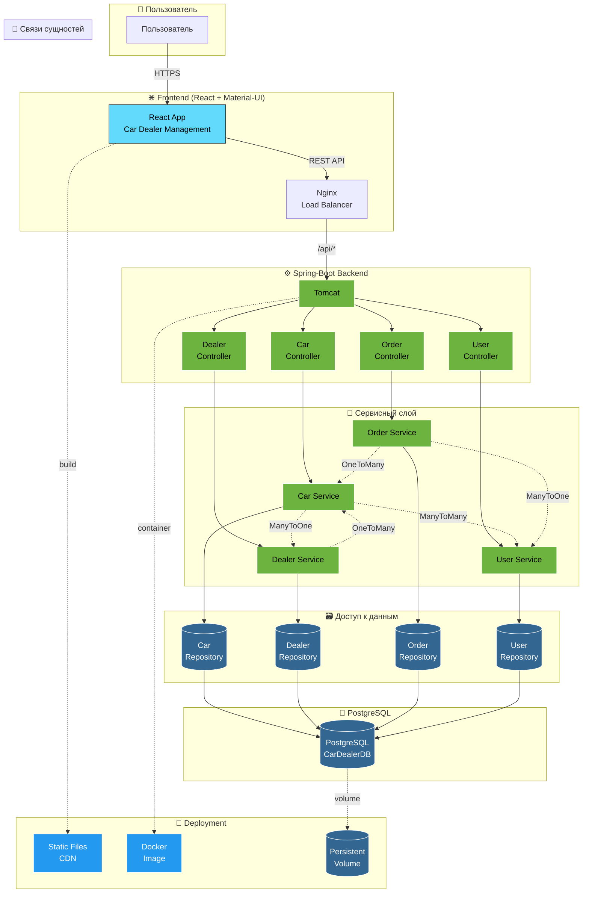

```mermaid
graph TB
    subgraph "👤 Пользователь"
        U[Пользователь]
    end

    %% ---------- Frontend ----------
    subgraph "🌐 Frontend (React + Material-UI)"
        U --> |HTTPS| RA[React App<br/>Car Dealer Management]
        RA --> |REST API| GLB
    end

    %% ---------- Gateway / LB ----------
    GLB[Nginx<br/>Load Balancer]

    %% ---------- Backend ----------
    subgraph "⚙️ Spring-Boot Backend"
        GLB --> |/api/*| SB[Tomcat]
        SB --> CC[Car<br/>Controller]
        SB --> DC[Dealer<br/>Controller]
        SB --> OC[Order<br/>Controller]
        SB --> UC[User<br/>Controller]
    end

    %% ---------- Services ----------
    subgraph "🔧 Сервисный слой"
        CC --> CS[Car Service]
        DC --> DS[Dealer Service]
        OC --> OS[Order Service]
        UC --> US[User Service]
    end

    %% ---------- Repositories ----------
    subgraph "🗃️ Доступ к данным"
        CS --> CR[(Car<br/>Repository)]
        DS --> DR[(Dealer<br/>Repository)]
        OS --> OR[(Order<br/>Repository)]
        US --> UR[(User<br/>Repository)]
    end

    %% ---------- База данных ----------
    subgraph "🐘 PostgreSQL"
        CR --> DB[(PostgreSQL<br/>CarDealerDB)]
        DR --> DB
        OR --> DB
        UR --> DB
    end

    %% ---------- Внешние связи ----------
    subgraph "🔗 Связи сущностей"
        CS -.-> |ManyToOne| DS
        CS -.-> |ManyToMany| US
        OS -.-> |ManyToOne| US
        OS -.-> |OneToMany| CS
        DS -.-> |OneToMany| CS
    end

    %% ---------- Deployment ----------
    subgraph "🐳 Deployment"
        RA -.-> |build| STAT[Static Files<br/>CDN]
        SB -.-> |container| DOCK[Docker<br/>Image]
        DB -.-> |volume| VOL[(Persistent<br/>Volume)]
    end

    classDef frontend fill:#61dafb,stroke:#282c34,color:#000
    classDef backend fill:#6db33f,stroke:#fff,color:#000
    classDef db fill:#336791,stroke:#fff,color:#fff
    classDef relations fill:#ff6b6b,stroke:#000,color:#000
    classDef deployment fill:#239aef,stroke:#fff,color:#fff

    class RA frontend
    class SB,CC,DC,OC,UC,CS,DS,OS,US backend
    class DB,CR,DR,OR,UR,VOL db
    class relations relations
    class STAT,DOCK deployment
```
