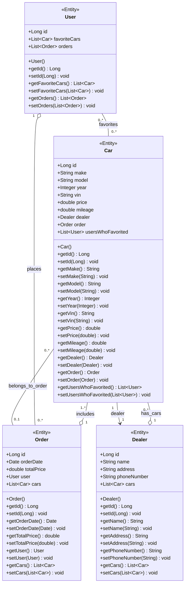

# 📊 Диаграмма классов

```mermaid
classDiagram
    class User {
        <<Entity>>
        +Long id
        +List~Car~ favoriteCars
        +List~Order~ orders
        +User()
        +getId() Long
        +setId(Long) void
        +getFavoriteCars() List~Car~
        +setFavoriteCars(List~Car~) void
        +getOrders() List~Order~
        +setOrders(List~Order~) void
    }

    class Dealer {
        <<Entity>>
        +Long id
        +String name
        +String address
        +String phoneNumber
        +List~Car~ cars
        +Dealer()
        +getId() Long
        +setId(Long) void
        +getName() String
        +setName(String) void
        +getAddress() String
        +setAddress(String) void
        +getPhoneNumber() String
        +setPhoneNumber(String) void
        +getCars() List~Car~
        +setCars(List~Car~) void
    }

    class Car {
        <<Entity>>
        +Long id
        +String make
        +String model
        +Integer year
        +String vin
        +double price
        +double mileage
        +Dealer dealer
        +Order order
        +List~User~ usersWhoFavorited
        +Car()
        +getId() Long
        +setId(Long) void
        +getMake() String
        +setMake(String) void
        +getModel() String
        +setModel(String) void
        +getYear() Integer
        +setYear(Integer) void
        +getVin() String
        +setVin(String) void
        +getPrice() double
        +setPrice(double) void
        +getMileage() double
        +setMileage(double) void
        +getDealer() Dealer
        +setDealer(Dealer) void
        +getOrder() Order
        +setOrder(Order) void
        +getUsersWhoFavorited() List~User~
        +setUsersWhoFavorited(List~User~) void
    }

    class Order {
        <<Entity>>
        +Long id
        +Date orderDate
        +double totalPrice
        +User user
        +List~Car~ cars
        +Order()
        +getId() Long
        +setId(Long) void
        +getOrderDate() Date
        +setOrderDate(Date) void
        +getTotalPrice() double
        +setTotalPrice(double) void
        +getUser() User
        +setUser(User) void
        +getCars() List~Car~
        +setCars(List~Car~) void
    }

    %% ---- Associations ----
    Dealer "1" o-- "0..*" Car : has_cars
    Car "0..*" -- "0..1" Order : belongs_to_order
    User "0..*" -- "0..*" Car : favorites
    User "1" o-- "0..*" Order : places
    Order "1" o-- "1..*" Car : includes
    Car "1" --> "1" Dealer : dealer
```
