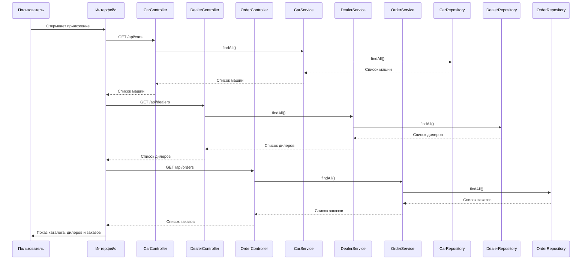
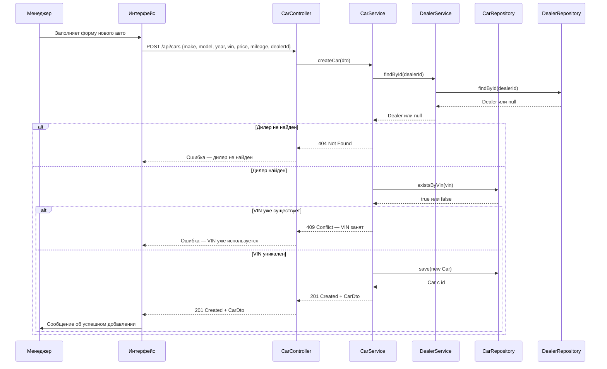
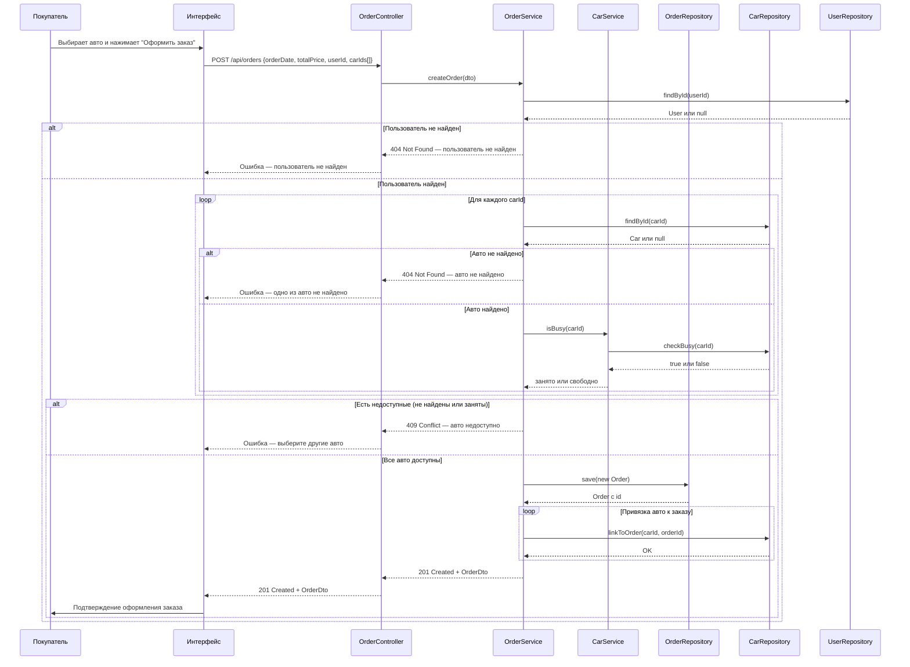

# 📊 Диаграммы последовательностей

### 1. Загрузка данных

```mermaid
sequenceDiagram
    participant User as Пользователь
    participant Frontend as Интерфейс
    participant Cars as CarController
    participant Dealers as DealerController
    participant Orders as OrderController
    participant CarService as CarService
    participant DealerService as DealerService
    participant OrderService as OrderService
    participant CarRepo as CarRepository
    participant DealerRepo as DealerRepository
    participant OrderRepo as OrderRepository

    User->>Frontend: Открывает приложение
    Frontend->>Cars: GET /api/cars
    Cars->>CarService: findAll()
    CarService->>CarRepo: findAll()
    CarRepo-->>CarService: Список машин
    CarService-->>Cars: Список машин
    Cars-->>Frontend: Список машин

    Frontend->>Dealers: GET /api/dealers
    Dealers->>DealerService: findAll()
    DealerService->>DealerRepo: findAll()
    DealerRepo-->>DealerService: Список дилеров
    DealerService-->>Dealers: Список дилеров
    Dealers-->>Frontend: Список дилеров

    Frontend->>Orders: GET /api/orders
    Orders->>OrderService: findAll()
    OrderService->>OrderRepo: findAll()
    OrderRepo-->>OrderService: Список заказов
    OrderService-->>Orders: Список заказов
    Orders-->>Frontend: Список заказов

    Frontend->>User: Показ каталога, дилеров и заказов
```

### 2. Добавление автомобиля

```mermaid
sequenceDiagram
    participant Manager as Менеджер
    participant Frontend as Интерфейс
    participant Cars as CarController
    participant CarService as CarService
    participant DealerService as DealerService
    participant CarRepo as CarRepository
    participant DealerRepo as DealerRepository

    Manager->>Frontend: Заполняет форму нового авто
    Frontend->>Cars: POST /api/cars {make, model, year, vin, price, mileage, dealerId}
    Cars->>CarService: createCar(dto)

    CarService->>DealerService: findById(dealerId)
    DealerService->>DealerRepo: findById(dealerId)
    DealerRepo-->>DealerService: Dealer или null
    DealerService-->>CarService: Dealer или null

    alt Дилер не найден
        CarService-->>Cars: 404 Not Found
        Cars-->>Frontend: Ошибка — дилер не найден
    else Дилер найден
        CarService->>CarRepo: existsByVin(vin)
        CarRepo-->>CarService: true или false

        alt VIN уже существует
            CarService-->>Cars: 409 Conflict — VIN занят
            Cars-->>Frontend: Ошибка — VIN уже используется
        else VIN уникален
            CarService->>CarRepo: save(new Car)
            CarRepo-->>CarService: Car с id
            CarService-->>Cars: 201 Created + CarDto
            Cars-->>Frontend: 201 Created + CarDto
            Frontend->>Manager: Сообщение об успешном добавлении
        end
    end
```

### 3. Оформление заказа

```mermaid
sequenceDiagram
    participant Buyer as Покупатель
    participant Frontend as Интерфейс
    participant Orders as OrderController
    participant OrderService as OrderService
    participant CarService as CarService
    participant OrderRepo as OrderRepository
    participant CarRepo as CarRepository
    participant UserRepo as UserRepository

    Buyer->>Frontend: Выбирает авто и нажимает "Оформить заказ"
    Frontend->>Orders: POST /api/orders {orderDate, totalPrice, userId, carIds[]}
    Orders->>OrderService: createOrder(dto)

    OrderService->>UserRepo: findById(userId)
    UserRepo-->>OrderService: User или null

    alt Пользователь не найден
        OrderService-->>Orders: 404 Not Found — пользователь не найден
        Orders-->>Frontend: Ошибка — пользователь не найден
    else Пользователь найден
        %% Проверка наличия и доступности каждого авто
        loop Для каждого carId
            OrderService->>CarRepo: findById(carId)
            CarRepo-->>OrderService: Car или null
            alt Авто не найдено
                OrderService-->>Orders: 404 Not Found — авто не найдено
                Orders-->>Frontend: Ошибка — одно из авто не найдено
            else Авто найдено
                OrderService->>CarService: isBusy(carId)
                CarService->>CarRepo: checkBusy(carId)
                CarRepo-->>CarService: true или false
                CarService-->>OrderService: занято или свободно
            end
        end

        %% Итоговая развилка по результатам проверок
        alt Есть недоступные (не найдены или заняты)
            OrderService-->>Orders: 409 Conflict — авто недоступно
            Orders-->>Frontend: Ошибка — выберите другие авто
        else Все авто доступны
            OrderService->>OrderRepo: save(new Order)
            OrderRepo-->>OrderService: Order с id

            loop Привязка авто к заказу
                OrderService->>CarRepo: linkToOrder(carId, orderId)
                CarRepo-->>OrderService: OK
            end

            OrderService-->>Orders: 201 Created + OrderDto
            Orders-->>Frontend: 201 Created + OrderDto
            Frontend->>Buyer: Подтверждение оформления заказа
        end
    end
```
