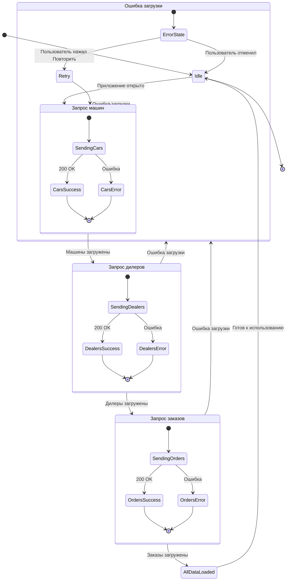
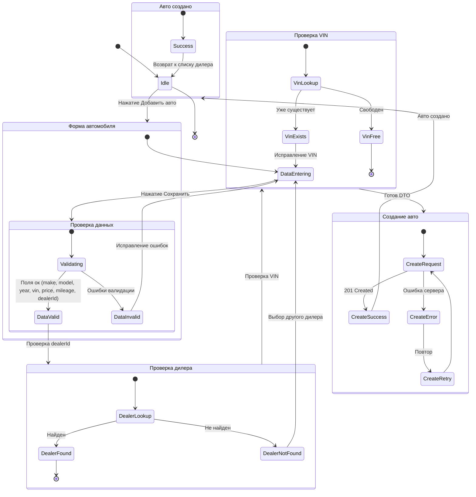
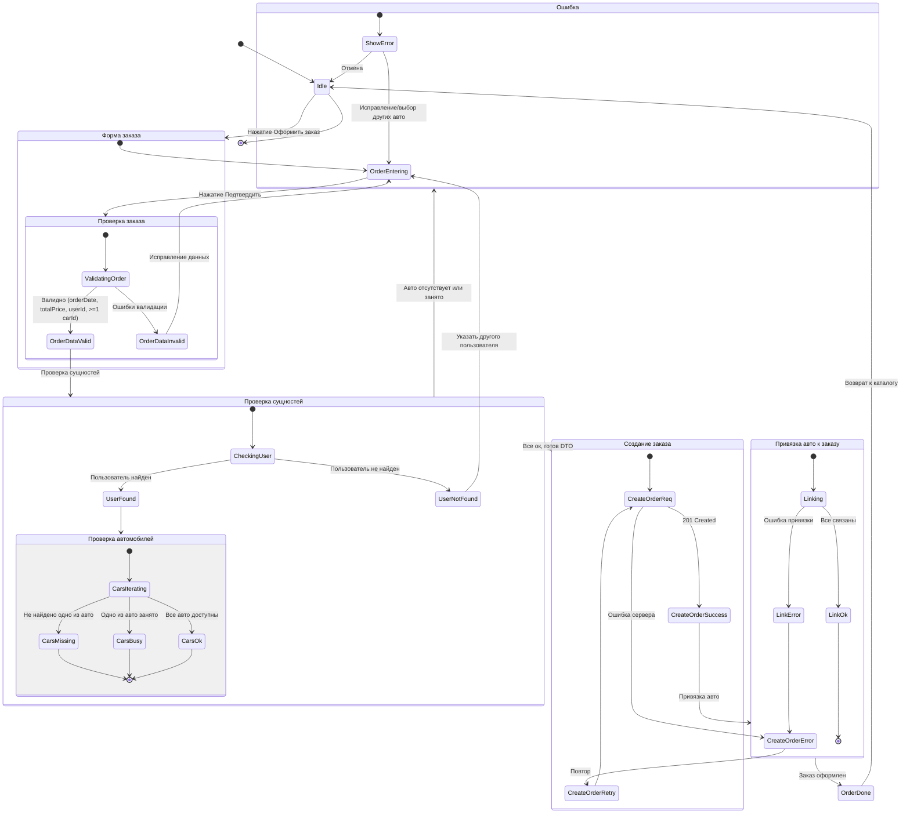

# 📊 Диаграммы состояний

### 1. Загрузка данных

```mermaid
stateDiagram-v2
    [*] --> Idle
    Idle --> RequestCars : Приложение открыто

    state "Запрос машин" as RequestCars {
        [*] --> SendingCars
        SendingCars --> CarsSuccess : 200 OK
        SendingCars --> CarsError : Ошибка
        CarsSuccess --> [*]
        CarsError --> [*]
    }

    RequestCars --> RequestDealers : Машины загружены
    RequestCars --> LoadError : Ошибка загрузки

    state "Запрос дилеров" as RequestDealers {
        [*] --> SendingDealers
        SendingDealers --> DealersSuccess : 200 OK
        SendingDealers --> DealersError : Ошибка
        DealersSuccess --> [*]
        DealersError --> [*]
    }

    RequestDealers --> RequestOrders : Дилеры загружены
    RequestDealers --> LoadError : Ошибка загрузки

    state "Запрос заказов" as RequestOrders {
        [*] --> SendingOrders
        SendingOrders --> OrdersSuccess : 200 OK
        SendingOrders --> OrdersError : Ошибка
        OrdersSuccess --> [*]
        OrdersError --> [*]
    }

    RequestOrders --> AllDataLoaded : Заказы загружены
    RequestOrders --> LoadError : Ошибка загрузки

    state "Ошибка загрузки" as LoadError {
        [*] --> ErrorState
        ErrorState --> Retry : Пользователь нажал Повторить
        Retry --> RequestCars
        ErrorState --> Idle : Пользователь отменил
    }

    AllDataLoaded --> Idle : Готов к использованию
    Idle --> [*]
```

### 2. Добавление автомобиля

```mermaid
stateDiagram-v2
    [*] --> Idle
    Idle --> FormOpened : Нажатие Добавить авто

    state "Форма автомобиля" as FormOpened {
        [*] --> DataEntering
        DataEntering --> DataValidation : Нажатие Сохранить
    }

    state "Проверка данных" as DataValidation {
        [*] --> Validating
        Validating --> DataValid : Поля ок (make, model, year, vin, price, mileage, dealerId)
        Validating --> DataInvalid : Ошибки валидации
        DataInvalid --> DataEntering : Исправление ошибок
    }

    DataValid --> CheckDealer : Проверка dealerId

    state "Проверка дилера" as CheckDealer {
        [*] --> DealerLookup
        DealerLookup --> DealerFound : Найден
        DealerLookup --> DealerNotFound : Не найден
        DealerNotFound --> DataEntering : Выбор другого дилера
        DealerFound --> [*]
    }

    CheckDealer --> CheckVin : Проверка VIN

    state "Проверка VIN" as CheckVin {
        [*] --> VinLookup
        VinLookup --> VinExists : Уже существует
        VinLookup --> VinFree : Свободен
        VinExists --> DataEntering : Исправление VIN
        VinFree --> [*]
    }

    CheckVin --> SendingCreate : Готов DTO

    state "Создание авто" as SendingCreate {
        [*] --> CreateRequest
        CreateRequest --> CreateSuccess : 201 Created
        CreateRequest --> CreateError : Ошибка сервера
        CreateError --> CreateRetry : Повтор
        CreateRetry --> CreateRequest
    }

    CreateSuccess --> Created : Авто создано

    state "Авто создано" as Created {
        [*] --> Success
        Success --> Idle : Возврат к списку дилера
    }

    Idle --> [*]
```

### 3. Оформление заказа

```mermaid
stateDiagram-v2
    [*] --> Idle
    Idle --> OrderForm : Нажатие Оформить заказ

    state "Форма заказа" as OrderForm {
        [*] --> OrderEntering
        OrderEntering --> OrderValidation : Нажатие Подтвердить
    }

    state "Проверка заказа" as OrderValidation {
        [*] --> ValidatingOrder
        ValidatingOrder --> OrderDataValid : Валидно (orderDate, totalPrice, userId, >=1 carId)
        ValidatingOrder --> OrderDataInvalid : Ошибки валидации
        OrderDataInvalid --> OrderEntering : Исправление данных
    }

    OrderDataValid --> CheckEntities : Проверка сущностей

    state "Проверка сущностей" as CheckEntities {
        [*] --> CheckingUser
        CheckingUser --> UserFound : Пользователь найден
        CheckingUser --> UserNotFound : Пользователь не найден
        UserNotFound --> OrderEntering : Указать другого пользователя

        UserFound --> CheckingCars
        state "Проверка автомобилей" as CheckingCars {
            [*] --> CarsIterating
            CarsIterating --> CarsMissing : Не найдено одно из авто
            CarsIterating --> CarsBusy : Одно из авто занято
            CarsIterating --> CarsOk : Все авто доступны
            CarsMissing --> [*]
            CarsBusy --> [*]
            CarsOk --> [*]
        }
    }

    CheckEntities --> OrderError : Авто отсутствует или занято
    CheckEntities --> SendCreate : Все ок, готов DTO

    state "Создание заказа" as SendCreate {
        [*] --> CreateOrderReq
        CreateOrderReq --> CreateOrderSuccess : 201 Created
        CreateOrderReq --> CreateOrderError : Ошибка сервера
        CreateOrderError --> CreateOrderRetry : Повтор
        CreateOrderRetry --> CreateOrderReq
    }

    CreateOrderSuccess --> LinkCars : Привязка авто

    state "Привязка авто к заказу" as LinkCars {
        [*] --> Linking
        Linking --> LinkOk : Все связаны
        Linking --> LinkError : Ошибка привязки
        LinkError --> CreateOrderError
        LinkOk --> [*]
    }

    LinkCars --> OrderDone : Заказ оформлен
    OrderDone --> Idle : Возврат к каталогу

    state "Ошибка" as OrderError {
        [*] --> ShowError
        ShowError --> OrderEntering : Исправление/выбор других авто
        ShowError --> Idle : Отмена
    }

    Idle --> [*]

```
