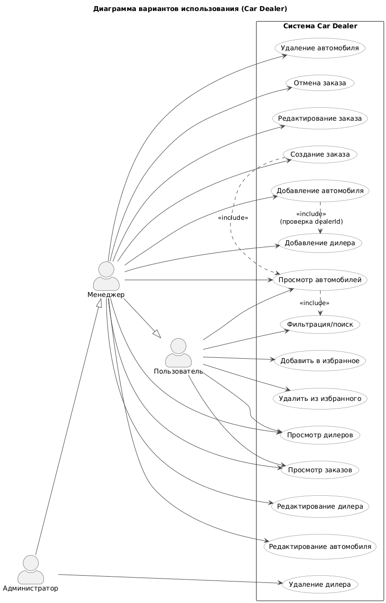

# 📊 Диаграмма вариантов использования

# Глоссарий

| Термин | Определение |
|:--|:--|
| Пользователь | Посетитель, который может просматривать автомобили, дилеров и заказы |
| Менеджер | Авторизованный сотрудник автосалона, может добавлять дилеров, автомобили и оформлять заказы |
| Администратор | Пользователь с расширенными правами, может редактировать и удалять данные |
| Автомобиль | Основная сущность системы: содержит марку, модель, год, VIN, цену и пробег |
| Дилер | Продавец автомобилей, к которому привязаны машины |
| Заказ | Сущность, отражающая покупку автомобиля пользователем |
| Избранное | Коллекция автомобилей, добавленных пользователем для быстрого доступа |

---

# Содержание
1 [Актёры](#actors)  
2 [Варианты использования](#use_cases)  
2.1 [Просмотр автомобилей](#view_cars)  
2.2 [Добавление автомобиля](#add_car)  
2.3 [Создание заказа](#create_order)  
2.4 [Просмотр заказов](#view_orders)  
2.5 [Добавление автомобиля в избранное](#add_favorite)  
2.6 [Добавление дилера](#add_dealer)  
2.7 [Редактирование данных дилера или автомобиля](#edit_data)  
2.8 [Удаление автомобиля или заказа](#delete_data)  

---

# 1 Актёры

| Актёр | Описание |
|:--|:--|
| Пользователь | Неавторизованный посетитель, который может просматривать автомобили и дилеров |
| Менеджер | Авторизованный сотрудник, который может добавлять дилеров, автомобили и оформлять заказы |
| Администратор | Пользователь с правами модерации и управления всеми сущностями |

---

# 2 Варианты использования

---

## 2.1 Просмотр автомобилей

**Описание.** Позволяет пользователю просматривать список всех доступных автомобилей и их дилеров.  
**Предусловия.** Система загружена и доступна.  
**Основной поток.**
1. Пользователь открывает главную страницу приложения;  
2. Система отправляет запросы на `/api/cars` и `/api/dealers`;  
3. Сервер возвращает списки автомобилей и дилеров;  
4. Система отображает их в виде карточек;  
5. Пользователь может фильтровать по марке, году или дилеру;  
6. Вариант использования завершается.  

---

## 2.2 Добавление автомобиля

**Описание.** Позволяет менеджеру добавить новый автомобиль в базу данных.  
**Предусловия.** Менеджер авторизован и находится в панели дилера.  
**Основной поток.**
1. Менеджер нажимает «Добавить авто»;  
2. Система открывает форму создания автомобиля;  
3. Менеджер вводит данные (марка, модель, VIN, цена, год, пробег, дилер);  
4. Система проверяет корректность данных;  
5. Проверяется уникальность VIN;  
6. Если ошибок нет — создаётся новая запись;  
7. Система уведомляет об успешном добавлении.  

**Альтернативный поток А1.**  
1. Введены невалидные данные или VIN уже существует;  
2. Система отображает сообщение об ошибке;  
3. Менеджер исправляет данные и повторяет попытку.  

---

## 2.3 Создание заказа

**Описание.** Позволяет менеджеру оформить заказ на выбранный автомобиль для покупателя.  
**Предусловия.** Менеджер авторизован, выбран автомобиль, пользователь указан.  
**Основной поток.**
1. Менеджер выбирает автомобиль и нажимает «Оформить заказ»;  
2. Система открывает форму заказа;  
3. Менеджер вводит дату, сумму и данные пользователя;  
4. Система проверяет, что автомобиль не занят;  
5. Заказ сохраняется на сервере;  
6. Система обновляет статусы автомобиля и списка заказов.  

**Альтернативный поток А1.**  
1. Автомобиль уже находится в другом заказе;  
2. Система сообщает о конфликте;  
3. Менеджер выбирает другой автомобиль.  

---

## 2.4 Просмотр заказов

**Описание.** Позволяет пользователю или менеджеру просмотреть список всех заказов.  
**Предусловия.** Пользователь открыл раздел заказов.  
**Основной поток.**
1. Система отправляет запрос `/api/orders`;  
2. Сервер возвращает список заказов;  
3. Заказы отображаются в таблице с фильтрацией по пользователю, авто или дате;  
4. Вариант использования завершается.  

---

## 2.5 Добавление автомобиля в избранное

**Описание.** Позволяет пользователю сохранить понравившийся автомобиль в избранное.  
**Предусловия.** Пользователь авторизован.  
**Основной поток.**
1. Пользователь нажимает на иконку «Избранное»;  
2. Система отправляет запрос `/api/users/{id}/favorites`;  
3. Сервер сохраняет связь между пользователем и автомобилем;  
4. Иконка меняет состояние на активное.  

**Альтернативный поток А1.**  
1. Автомобиль уже был добавлен;  
2. Система уведомляет пользователя.  

---

## 2.6 Добавление дилера

**Описание.** Позволяет менеджеру добавить нового дилера в систему.  
**Предусловия.** Менеджер авторизован.  
**Основной поток.**
1. Менеджер нажимает «Добавить дилера»;  
2. Вводит название, адрес, телефон;  
3. Система проверяет корректность данных;  
4. Создаёт нового дилера и добавляет в список.  

---

## 2.7 Редактирование данных дилера или автомобиля

**Описание.** Позволяет менеджеру или администратору изменить данные о дилере или автомобиле.  
**Предусловия.** Пользователь авторизован и имеет права на редактирование.  
**Основной поток.**
1. Пользователь открывает карточку автомобиля или дилера;  
2. Нажимает «Редактировать»;  
3. Вносит изменения в поля;  
4. Система проверяет валидность данных;  
5. Обновляет запись на сервере;  
6. Отображает уведомление об успешном обновлении.  

---

## 2.8 Удаление автомобиля или заказа

**Описание.** Позволяет менеджеру или администратору удалить запись об автомобиле или заказе.  
**Предусловия.** Пользователь авторизован и имеет соответствующие права.  
**Основной поток.**
1. Пользователь нажимает «Удалить»;  
2. Система запрашивает подтверждение;  
3. Пользователь подтверждает действие;  
4. Система удаляет запись из базы данных;  
5. Обновляется список элементов.  

**Альтернативный поток А1.**  
1. Пользователь отменяет удаление;  
2. Система возвращает на предыдущий экран.  

---
